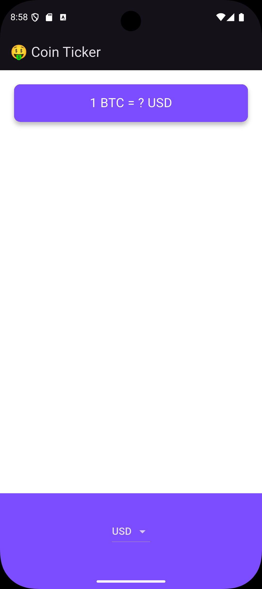

# Coin Ticker 🤑

A Flutter application that displays the current Bitcoin price in different fiat currencies using the CoinGecko API.

## 📱 About

Coin Ticker allows users to check the Bitcoin price in their selected currency. The app fetches price data from the CoinGecko API and updates the displayed price when the currency changes.

## ✨ Features

* Display Bitcoin price in different currencies.
* Fetch cryptocurrency prices using the CoinGecko API.
* Select currencies using a dropdown menu on Android.
* Select currencies using a Cupertino picker on iOS.
* Simple and clean user interface.

## 📸 Screenshots

### Android

### iOS

## 🛠️ Built With

* Flutter
* Dart
* HTTP package
* CoinGecko API

## 🌍 Supported Currencies

AUD, BRL, CAD, CNY, EUR, GBP, HKD, IDR, ILS, INR, JPY, MXN, NOK, NZD, PLN, RON, RUB, SEK, SGD, USD, ZAR

## 🚀 Getting Started

### Prerequisites

* Flutter SDK
* Dart SDK
* Android Studio or VS Code

## 👩‍💻 Author

**Bita Narimani**

[GitHub Profile](https://github.com/BiTa5N)
